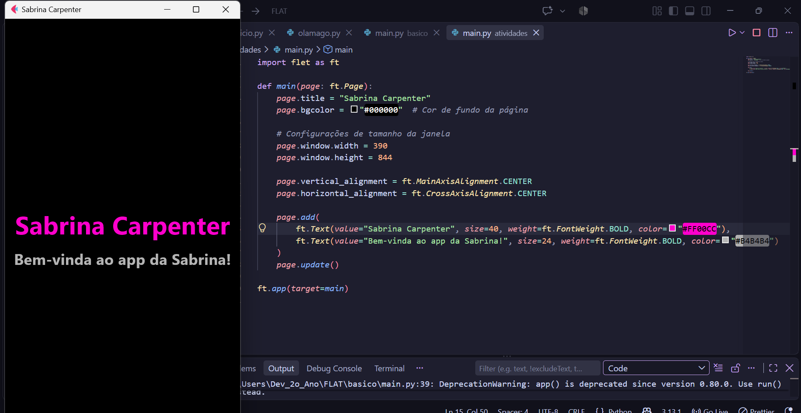
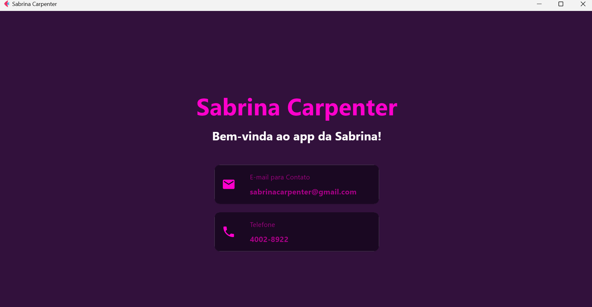
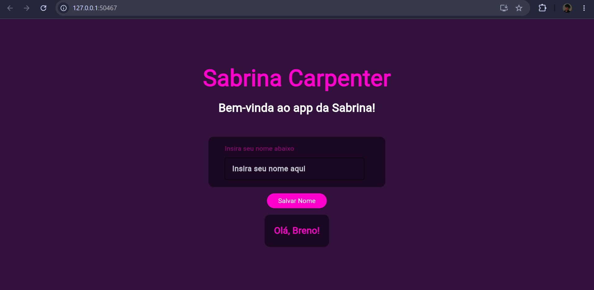
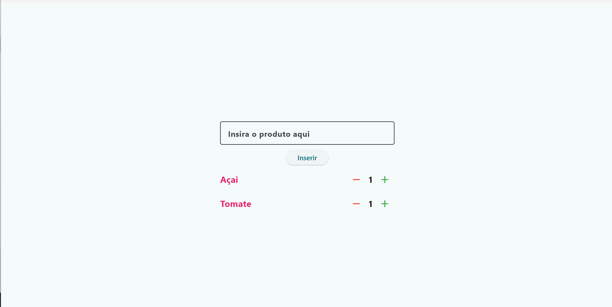
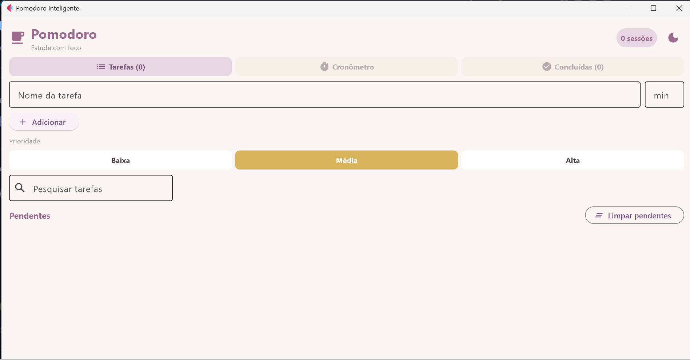

# Estudos com Flet — Python UI Framework

<p align="center">
  
  
  
  
  <br>
  
  
</p>

---

## O que é este repositório?

Este repositório reúne os meus **estudos práticos com o framework Flet**, uma biblioteca Python que permite criar aplicações desktop, web e mobile com uma única base de código — usando os mesmos conceitos do Flutter, mas escrevendo 100% em Python.

O objetivo é documentar a evolução do aprendizado: do primeiro "Olá Mundo" até projetos completos com estado centralizado, persistência de dados e múltiplas telas.

> **Por que Flet?** Por ser a ponte mais direta entre Python puro e interfaces modernas multiplataforma — sem HTML, sem JavaScript, sem frameworks separados.

---

## Estrutura do Repositório

```
FLET/
├── basico/
│   ├── inicio.py           # Primeiro contato com a biblioteca
│   ├── olamago.py          # App mínimo com texto e view em browser
│   └── main.py             # Contador de números interativo
│
├── atividades/
│   ├── atividade1/
│   │   └── main.py         # Tela estática com título e subtítulo
│   ├── atividade2/
│   │   └── main.py         # Cards de contato com ícones
│   ├── atividade3/
│   │   └── main.py         # Input de texto com saudação dinâmica
│   ├── atividade4/
│   │   └── main.py         # Lista de compras com quantidade dinâmica
│   └── capturas/
│       ├── captura1.png
│       ├── captura2.png
│       ├── captura3.png
│       └── captura4.png
│
└── projetos/
    └── pomodoro/
        ├── main.py         # Pomodoro Inteligente v2 (app completo)
        ├── tarefas.json    # Gerado automaticamente pelo app
        └── capturas/
            └── captura1.png
```

---

## Básico — Primeiros Passos

### `inicio.py` — Estrutura mínima

O primeiro arquivo: apenas importar o Flet e entender a assinatura da função `main(page: ft.Page)`. Nenhum widget ainda — só o esqueleto que toda aplicação Flet precisa ter.

```python
import flet as ft

def main(pagina: ft.Page):
    pass

ft.run(main)
```

---

### `olamago.py` — Primeiro texto na tela

Aqui a página ganha título e dois componentes `ft.Text`. O `view=ft.AppView.WEB_BROWSER` faz o app abrir diretamente no navegador em vez de janela desktop.

```python
import flet as ft

def main(pagina: ft.Page):
    pagina.title = "Ola Mago"
    pagina.add(ft.Text("Ola Mago"))
    pagina.add(ft.Text("Bem-vindo ao Flet!"))

ft.run(main, view=ft.AppView.WEB_BROWSER)
```

**Conceitos praticados:** `ft.Page`, `ft.Text`, `page.add()`, `page.title`.

---

### `main.py` — Contador interativo

O primeiro app com **estado e eventos**: um número grande no centro da tela e dois botões que incrementam ou decrementam o valor. A cada clique, `page.update()` re-renderiza somente o componente alterado.

```python
def adicionar(e):
    contador.value = str(int(contador.value) + 1)
    pagina.update()

def remover(e):
    contador.value = str(int(contador.value) - 1)
    pagina.update()
```

**Conceitos praticados:** `ft.ElevatedButton`, `on_click`, `ft.Row`, `MainAxisAlignment`, `page.update()`, `bgcolor`, alinhamento centralizado.

---

## Atividades

As atividades formam uma sequência progressiva: cada uma adiciona uma camada de complexidade sobre a anterior, sempre dentro do mesmo tema visual.

---

### Atividade 1 — Tela Estática com Título

**Objetivo:** criar uma tela com fundo preto, título em rosa neon e subtítulo em cinza. A janela é configurada com tamanho mobile (390×844 px), simulando um smartphone.

```python
page.window.width = 390
page.window.height = 844
```

**Conceitos praticados:** `page.bgcolor`, `page.window.width/height`, `ft.FontWeight.BOLD`, cores hexadecimais, alinhamento central.

**Captura:**



> A janela ao lado exibe o código no VS Code, demonstrando o ciclo de desenvolvimento: editar → executar → ver resultado imediatamente.

---

### Atividade 2 — Cards de Contato

**Objetivo:** evoluir a tela anterior adicionando **cards** com ícones, para exibir informações de contato estruturadas. O fundo muda para roxo escuro (`#32113C`) e os cards usam um roxo mais profundo (`#1A0822`).

Cada card é composto por um `ft.Card` → `ft.Container` → `ft.Row` → `ft.Icon` + `ft.Column` com dois textos, criando uma hierarquia de componentes real.

```python
card_email = ft.Card(
    content=ft.Container(
        content=ft.Row([
            ft.Icon(ft.Icons.EMAIL, color="#FF00CC", size=30),
            ft.Column([
                ft.Text("E-mail para Contato", size=14, color="#A60085"),
                ft.Text("sabrinacarpenter@gmail.com", size=16, weight=ft.FontWeight.BOLD, color="#A60085"),
            ], tight=True),
        ]),
        padding=15, width=350, bgcolor="#1A0822", border_radius=11,
    )
)
```

**Conceitos praticados:** `ft.Card`, `ft.Container`, `ft.Row`, `ft.Column`, `ft.Icon`, `padding`, `border_radius`, composição de widgets.

**Captura:**



> Interface rodando como aplicação desktop nativa. Dois cards empilhados: e-mail (ícone de envelope) e telefone (ícone de telefone), com paleta em magenta e roxo.

---

### Atividade 3 — Input de Texto e Saudação Dinâmica

**Objetivo:** adicionar **interatividade real** — um campo de texto onde o usuário digita o nome, um botão "Salvar Nome" e um card de resultado que aparece dinamicamente com a saudação personalizada.

O card de resultado começa invisível (`visible=False`) e só aparece após o clique no botão, demonstrando **reatividade de estado** no Flet.

```python
texto_resultado = ft.Text(value="", size=20, weight=ft.FontWeight.BOLD, color="#FF00CC")
card_resultado = ft.Card(visible=False, ...)

def salvar_clique(e):
    if input_nome.value:
        texto_resultado.value = f"Olá, {input_nome.value}!"
        card_resultado.visible = True
        input_nome.value = ""
        page.update()
```

O app roda no **navegador web** via `ft.AppView.WEB_BROWSER`, mostrando a portabilidade do Flet sem nenhuma mudança no código.

**Conceitos praticados:** `ft.TextField`, `ft.ElevatedButton`, `ft.ButtonStyle`, `visible`, reatividade de estado com `page.update()`, limpeza do campo após submit.

**Captura:**



> App rodando em `127.0.0.1` no Chrome. Após digitar "Breno" e clicar em "Salvar Nome", o card de resultado aparece com "Olá, Breno!" — e o campo é limpo automaticamente para a próxima entrada.

---

### Atividade 4 — Lista de Compras com Quantidade Dinâmica

**Objetivo:** construir um app funcional do zero — uma lista de compras onde o usuário digita um produto, clica em "Inserir" e vê o item aparecer na tela com botões de **+** e **−** para controlar a quantidade, além de poder remover qualquer item individualmente.

Esta é a atividade de maior complexidade até aqui: cada linha da lista é um componente criado dinamicamente com **closures** (funções internas que capturam a referência do próprio elemento), permitindo que o botão de remoção saiba exatamente qual linha excluir.

```python
def criar_linha(produto):
    qtd_texto = ft.Text("1", size=18, weight=ft.FontWeight.BOLD)

    def adicionar(e):
        qtd_texto.value = str(int(qtd_texto.value) + 1)
        page.update()

    linha = ft.Row([nome, grupo_quantidade], ...)
    return linha

def remover_linha(linha):
    if linha in lista_produtos.controls:
        lista_produtos.controls.remove(linha)
        page.update()
```

O `ft.Column` funciona como container reativo da lista: toda vez que um item é adicionado ou removido via `.controls.append()` / `.controls.remove()`, basta chamar `page.update()` para refletir a mudança na tela — sem re-renderizar tudo.

**Conceitos praticados:** `ft.Column` como lista dinâmica, `ft.IconButton`, closures em event handlers, factory function de componentes (`criar_linha`), `ft.Theme` com `color_scheme_seed`, limpeza de campo pós-inserção, `input.value.strip()` para validação básica.

**Captura:**



> Lista com dois itens inseridos ("Açaí" e "Tomate"), cada um com seus botões de incremento (verde) e remoção (vermelho). O campo de input fica vazio após a inserção, pronto para o próximo produto.

---

## Projetos

Além dos exercícios guiados, o repositório inclui projetos completos que consolidam tudo que foi aprendido nas atividades.

---

### Pomodoro Inteligente v2

**Objetivo:** construir um aplicativo desktop completo de produtividade — gerenciador de tarefas integrado a um cronômetro Pomodoro, com persistência de dados, sistema de temas e 12 funcionalidades distintas em um único arquivo Python.

Este projeto representa um salto de complexidade em relação às atividades: saiu de componentes isolados para uma **arquitetura com estado centralizado**, navegação entre telas, threads e ciclo de vida completo de um app real.

#### Funcionalidades implementadas

- Adicionar, editar e excluir tarefas com nome, tempo e prioridade (Alta / Média / Baixa)
- Barra lateral colorida por prioridade em cada cartão de tarefa
- Pesquisa e filtro de tarefas em tempo real
- Limpar pendentes ou concluídas em lote; refazer uma tarefa concluída
- Cronômetro de contagem regressiva `MM:SS` com barra de progresso visual
- Porcentagem e tempo decorrido/restante simultâneos; aviso visual nos últimos 20%
- Ciclo automático Estudo → Descanso (toggle on/off)
- Contador de sessões concluídas no cabeçalho
- Atalhos de teclado: `Espaço` para iniciar/pausar, `R` para resetar
- Alerta sonoro ao fim da sessão (Windows), com opção de silenciar
- Tema claro pastel e escuro pastel com troca instantânea
- Persistência automática em `tarefas.json` — salva a cada alteração, recarrega ao abrir

#### Padrões e técnicas utilizados

**Estado centralizado:** toda a lógica lê e escreve em um único dicionário `ESTADO`, evitando variáveis globais soltas e tornando o fluxo de dados previsível em funções aninhadas.

**Thread para o cronômetro:** `page.run_thread(tick)` mantém a contagem regressiva sem bloquear a UI, com `ESTADO["rodando"]` como flag de controle thread-safe.

**Closures em cartões dinâmicos:** cada cartão captura sua referência à tarefa via `lambda e, t=t: ...`, garantindo que editar/apagar opere sobre o item correto mesmo após múltiplas inserções.

```python
# Estado centralizado
ESTADO = {
    "tema": "clara", "som": True, "auto_descanso": False,
    "tarefas": [], "tarefa_atual": None,
    "tempo_total": 0, "tempo_restante": 0,
    "rodando": False, "sessoes": 0,
}

# Thread do cronômetro
def tick():
    while ESTADO["rodando"] and ESTADO["tempo_restante"] > 0:
        time.sleep(1)
        ESTADO["tempo_restante"] -= 1
        atualizar_visual_cronometro()
    if ESTADO["tempo_restante"] <= 0:
        finalizar()

# Closure em cartão dinâmico
ft.IconButton(
    icon=ft.Icons.DELETE,
    on_click=lambda e, t=t: apagar_tarefa(t)
)
```

**Captura:**



> Interface no tema claro pastel com a aba **Tarefas** aberta: chips de prioridade selecionáveis no topo, campo de pesquisa e lista de tarefas com barra lateral colorida por prioridade, além dos botões de editar, executar e apagar em cada cartão.

---

## Tecnologias

| Tecnologia | Uso |
|-----------|-----|
| **Python 3.10+** | Linguagem principal |
| **Flet 0.24+** | Framework de UI multiplataforma |
| **VS Code** | Editor e ambiente de desenvolvimento |
| **Flutter Engine** | Motor de renderização por baixo do Flet |

---

## Como Executar

### Pré-requisitos

- Python 3.10 ou superior instalado
- pip atualizado

### 1. Clone o repositório

```bash
git clone https://github.com/Breno-J-Oliveira/FLET.git
cd FLET
```

### 2. Instale o Flet

```bash
pip install flet
```

### 3. Execute qualquer exemplo

```bash
# Básico — contador
python basico/main.py

# Atividade 1
python atividades/atividade1/main.py

# Atividade 2
python atividades/atividade2/main.py

# Atividade 3 (abre no browser)
python atividades/atividade3/main.py

# Atividade 4
python atividades/atividade4/main.py

# Projeto — Pomodoro Inteligente v2
python projetos/pomodoro/main.py
```

> Arquivos com `view=ft.AppView.WEB_BROWSER` abrem automaticamente no navegador padrão. Os demais abrem como janela desktop nativa.

---

## O que aprendi até aqui

- **Estrutura de uma app Flet** — função `main(page)`, `ft.run()` / `ft.app()`
- **Componentes base** — `ft.Text`, `ft.ElevatedButton`, `ft.TextField`, `ft.Icon`
- **Layout** — `ft.Row`, `ft.Column`, `ft.Container`, `ft.Card`
- **Alinhamento** — `MainAxisAlignment`, `CrossAxisAlignment`, centralização de página
- **Eventos** — `on_click`, leitura de `.value`, `page.update()`
- **Estado reativo** — mostrar/ocultar componentes com `visible`, atualizar valores em tempo real
- **Estilo** — `bgcolor`, `color`, `border_radius`, `padding`, `FontWeight`, `ButtonStyle`
- **Views** — `ft.AppView.WEB_BROWSER` vs janela desktop
- **Listas dinâmicas** — `ft.Column` e `ft.ListView` como containers reativos
- **Closures em eventos** — funções internas que capturam referências de componentes específicos
- **Factory de componentes** — função que constrói e retorna um widget completo
- **`ft.IconButton`** — botões de ícone com `tooltip`, `icon_color` e `on_click`
- **Estado centralizado** — dicionário global como fonte única de verdade do app
- **Threads** — `page.run_thread()` para operações sem bloquear a UI
- **Persistência** — leitura e escrita em JSON com `pathlib.Path`
- **Sistema de temas** — paleta de cores trocada dinamicamente em todos os componentes
- **`ft.AlertDialog`** — diálogo modal com validação de campos
- **`ft.ProgressBar`** e **`ft.SnackBar`** — feedback visual e notificações
- **Atalhos de teclado** — `page.on_keyboard_event`

---

## Roadmap

| Feature | Status |
|---------|--------|
| Básico — textos e estrutura | ✅ Concluído |
| Atividade 1 — tela estática | ✅ Concluído |
| Atividade 2 — cards e ícones | ✅ Concluído |
| Atividade 3 — input e estado | ✅ Concluído |
| Atividade 4 — lista dinâmica | ✅ Concluído |
| Projeto — Pomodoro Inteligente v2 | ✅ Concluído |
| Navegação entre telas (`ft.Route`) | 🔜 Planejado |
| Consumo de API REST | 🔜 Planejado |
| Tema escuro/claro dinâmico em novas atividades | 🔜 Planejado |
| Build para desktop (executável `.exe`) | 🔜 Planejado |
| Deploy web com Flet Cloud | 🔜 Planejado |

---

## Contatos e Redes Sociais

<p align="center">
  <a href="https://github.com/Breno-J-Oliveira" target="_blank">
    
  </a>
  <a href="https://www.linkedin.com/in/breno-j-oliveira-672619352/" target="_blank">
    
  </a>
  <a href="https://www.instagram.com/brenoov" target="_blank">
    
  </a>
  <a href="https://x.com/BrenoJOliveira_" target="_blank">
    
  </a>
</p>
